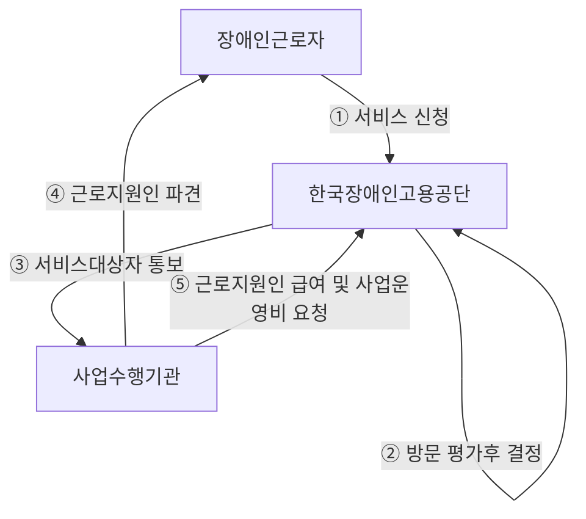

# → 청각ㆍ언어장애

| 분야           | 지원 내용 예시                                                                                                                                                                                   |
| ------------ | ------------------------------------------------------------------------------------------------------------------------------------------------------------------------------------------ |
| 교수학습         | - 수업 중 언어적 피드백 필요 시 지원(언어적 촉구 및 모델링, 질의응답 등) - 음성 및 영상 매체 접근 및 활용 시 지원 - 현장체험학습 관련 지원(학생 인솔 등) - 평가업무 시 지원(구술평가 등)                                                             |
| 학생지도         | - 통학지도 지원(통학버스 차량 통제, 교통지도 등) - 언어적 의사소통 진행 시 지원(상담 등) - 급식지도 지원(학생 질서 관리 감독 및 식사 지원) - 도전 행동 등 지도 시 지원(공격적 행동, 공간 이탈 행동, 신변자립 훈련 등) - 돌발상황 발생 시 현장 통제 지원(학생 간 싸움, 안전사고 등) |
| 학급운영         | - 학급행사 시 학생 관리 지원                                                                                                                                                                          |
| 교무행정 및 교원 인사 | - 전화 업무 시 지원 - 대면/비대면 회의, 연수 참여 시 지원                                                                                                                                                   |
| 기타           | - 교내외 방송, 비상상황 발생 시 경보벨 울림 등에 대한 파악                                                                                                                                                        |

다) 지원 대상

◦교육청 및 각급학교에서 제공하는 지원인력은 수업 운영, 학생 지도, 학급 또는 학교 업무 등 을 수행하는 과정에서 인적지원을 필요로 하는 장애인교원에게 제공할 수 있음

◦한국장애인고용공단에서 제공하는 근로지원인은 「장애인고용촉진 및 직업재활법」 제19조 의2에 따른 중증장애인교원에게 제공할 수 있음

※ 지원 제외 대상

- 월 소정근로시간이 60시간 미만인 장애인근로자

- 최저임금 미만을 지급받는 장애인근로자 중 최저임금 적용제외 인가를 받지 않은 자

※ 지원 한도: 법정근로시간 내 (1일 8시간, 주 40시간 이내)

- 수행업무에 대한 직무평가를 통하여 지원시간 결정, 예산 범위 내 지원(본인부담금 시간당 300원)

참 고

| 구분    | 지원 한도                          | 지원 한도                                                               |
| ----- | ------------------------------ | ------------------------------------------------------------------- |
| 근로지원인 | 1인당 지원금                        | · 시간당 9,160원                                                        |
|       | 1인당 지원금 (한국수어통역, 점역교정, 속기) | · 시간당 10,992원                                                       |
| 본인부담금 | 장애인 부담                         | · 시간당 300원 · 단, 2명의 중증장애인을 동시에 지원하는 경우 시간당 180원, 3명의 경우 13원 |

라) 근로지원인 신청 절차 및 이용 안내

◦근로지원인 신청 절차 및 이용 안내

* **신청서 작성**: 장애인교원 (직접) <!-- TODO: image-link source=2024-jbu-work-support-guide -- 원본: (이미지: 플로우차트의 신청서 작성 단계에 있는 아이콘으로, 장애인 근로인이 직접 서류를 작성하는 모습을 표현합니다. 이것은 서비스 신청의 첫 번째 단계를 상징합니다.) -->
* **접수**: 한국장애인고용공단 관할 지사를 통해 신청 (대표번호 1588-1519) <!-- TODO: image-link source=2024-jbu-work-support-guide -- 원본: (이미지: 플로우차트의 접수 단계에 있는 아이콘으로, 한국장애인고용공단을 상징하는 건물 그림입니다. 근로지원인 서비스 신청이 접수되는 과정을 나타냅니다.) -->
* **방문 평가**: 한국장애인고용공단 관할 지사에서 방문 평가를 통해 서비스 대상자 여부 및 근로 지원인 제공 시간 판정
* **결정 통지**: 서비스 대상자 통보 및 사업수행기관을 통한 근로지원인 파견

◦신청시 필요한 서류
- 근로지원인 서비스 신청서(별도 양식 활용)
- 개인정보 수집 · 이용 및 제공 사전 동의서(별도 양식 활용)
- 중증장애인 기준에 적합함을 인정할 수 있는 서류(\*「전자정부법」에 따른 행정정보 공동이용에 동의하는 경우 중증장애인 인정 서류 생략 가능)
- 지원 대상 확인을 위해 공단에서 요청하는 추가자료(근로계약서, 임금대장 등)

> > **근로지원인 활용시 고려 사항**
>
> > ▪근로지원인은 장애인근로자의 부수적 업무를 효과적으로 지원하기 위해 장애인근로자 개개인의 요구에 따라 제공되는 편의제공 중 하나임. 장애인교원이 근로지원인을 직접 신청하고, 선택할 수 있으며, 근로지원인의 이용 유지, 중지 또는 취소도 할 수 있으므로 맞춤형 인적 지원 서비스를 제공할 수 있는 장점을 갖고 있음
>
> > ▪컴퓨터 활용 능력, 수어통역, 문자통역, 속기 등과 같은 전문성을 갖춘 인적지원을 필요로 하는 경우 근로지원인을 활용할 수 있으나 필요에 따라 다른 인적지원을 활용하는 것도 고려할 수 있음
>
> > ▪근로지원인제도는 시 · 도교육청이 배치 및 관리하는 인력이 아닌 한국장애인고용공단으로부터 근로지원인 지원사업을 위탁 수행받은 기관이 담당하고 있으므로 노무 관련 문제 발생시 한국장애인고용공단 지역별 지사 및 위탁 수행기관을 통해 문의하여야 함

## 관련 페이지

같은 챕터의 다른 페이지:

- [[2024-jbu-2-3]] — 2) 의사소통지원
- [[2024-jbu-p-012]] — → 지체장애
