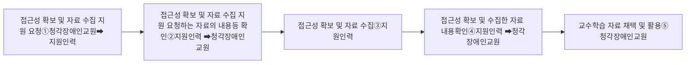

# 1 수업 준비

### 가. 교수학습 계획 내용 파악

지원인력은 청각장애인교원이 수업을 계획하는 데에 전념할 수 있도록 청각장애인교원의 청력 특성, 의사소통 지원 방식 및 청각장애인교원의 요청에 따라 교수학습계획단계에서의 업무를 지원한다. 따라서 지원인력은 교수학습계획단계에서 청각적 청취가 필요한 부분을 어떻게 지원할지를 청각장애인교원과 소통하며 지원계획을 세울 수 있다.

### 나. 교수학습자료 개발 및 준비

청각장애인교원은 청각적 청취의 양이 많을수록 정보 접근성에 상당한 영향을 받는다. 청각장애인교원이 교수학습 자료를 개발할 때 실제적인 다양한 청각적 정보와 자료를 검색 및 수집하는 경우가 있다. 지원인력은 다음과 같은 정보나 자료의 접근성 확보 및 자료 수집을 지원할 수 있다.

#### □ 자료의 접근성 확보 및 수집을 요청하는 자료의 유형

* 폐쇄자막 및 수어통역 지원이 없는 청각적 자료
* 그 외 검색 및 수집을 요청하는 자료

#### □ 자료의 접근성 확보 및 수집 지원 절차 흐름도

① 청각장애인교원은 지원인력에게 접근성 확보 및 정보 수집 지원을 요청한다.

② 청각장애인교원은 지원인력에게 접근성 확보 및 정보 수집 지원 요청하는 자료의 내용을 설명하고, 지원인력은 이를 확인한다.
③ 지원인력은 청각장애인교원의 요청에 따라 접근성 확보 및 자료 수집을 수행한다.

④ 지원인력은 접근성 확보 및 정보 수집을 완료한 후에 청각장애인교원에게 자료를 설명하고 청각장애인교원이 요청한 자료가 맞는지 여부를 확인한다.

⑤ 청각장애인교원은 지원인력이 접근성 지원 및 수집한 자료가 요청한 자료와 일치하는지 여부를 확인한 후에 교수 학습 자료로 채택하여 활용한다.

문자통역을 제공하는 지원인력은 자료의 접근성 확보를 위해 해당 자료의 청각적 정보를 그대로 통역할 수 있다. 수어통역과 음성통역을 제공하는 지원인력은 청각장애인교원의 요청에 따라 자료를 수집할 수 있다.

## 관련 페이지

같은 챕터의 다른 페이지:

- [[2024-staff-p-145]] — 다. 지원 기자재 여건 확인
- [[2024-staff-p-146]] — 라. 갑작스러운 상황을 예상하여 대처 방안 논의
