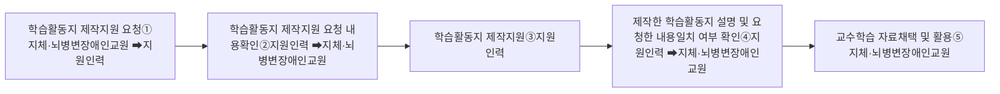

# 2) 학습활동지 제작

지원인력은 지체·뇌병변장애인교원이 교수학습 과정에서 활용할 학습활동지 제작을 지원해야 한다. 지원인력은 학습활동지에 들어갈 내용을 지체·뇌병변장애인교원이 작성할 때 학습활동지의 글자, 그림, 삽화, 사진, 도표, 그래프 등 자료 입력 부분과 학습활동지의 서식, 디자인, 글꼴, 글자 크기, 정렬, 줄 간격, 글자색, 표 등의 학습활동지의 형식적인 부분 편집 등을 지원해야 한다.

### □ 학습활동지 제작 지원 절차 흐름도

① 지체·뇌병변장애인교원은 지원인력에게 학습활동지 제작 지원을 요청한다.

② 지체·뇌병변장애인교원은 학습활동지의 자료 입력과 형식적인 부분의 편집 등 학습활동지 제작 지원 요청하는 내용을 지원인력에게 명확히 설명하고, 지원인력은 요청하는 내용을 확인한다.

③ 지원인력은 지체·뇌병변장애인교원의 요청에 따라 학습활동지 제작을 지원한다.

④ 지원인력은 학습활동지 제작 지원을 완료한 후에 지체·뇌병변장애인교원에게 제작한 학습활동지를 설명하고 지체·뇌병변장애인교원은 요청한 내용과 맞는지 여부를 확인한다.

⑤ 지체·뇌병변장애인교원은 지원인력이 제작을 지원한 학습활동지가 요청한 내용과 일치하는지 여부를 확인한 후에 교수학습 자료로 채택하여 활용한다.

**유의사항**

\* 학습활동지 제작 지원 과정에서 학습활동지 내용에 오탈자를 발견한 경우 지체·뇌병변장애인교원에게 의도된 것인지 여부를 확인한 후에 지체·뇌병변장애인교원의 답변에 따라 수정 여부를 결정한다.

\* 학습활동지 제작이 완료된 경우 담당 학급 수 및 학급당 학생 수에 따라 인쇄물 출력을 학교 이등사실(인쇄실 등)에 의뢰하여야 하는 경우가 있다. 학습활동지의 인쇄 출력을 의뢰하고 출력된 학습활동지를 찾아와서 관리하는 것은 지체·뇌병변장애인교원과의 협의에 따라 지원인력이 수행한다.
