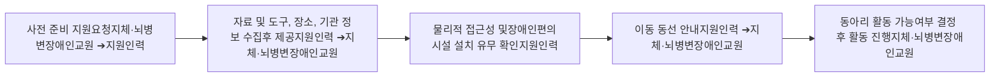
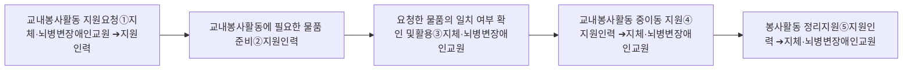

# 2) 동아리 활동

동아리 활동은 동아리 지도 교사별로 동아리를 개설하고 학생들의 선택에 의해 구성된다.

동아리 활동은 동아리 담당 지도 교사에 따라 인문, 예술, 체육, 탐구 활동 등 동아리별 활동 주제와 내용이 매우 상이하다. 여기서는 교내 및 교외의 활동 장소 구분에 따른 지원인력의 동아리 활동 지원 역할과 업무에 대해 다룬다.

### (1) 교내 활동 동아리

교내 활동 동아리는 활동 주제와 내용에 따라 인문, 예술, 체육, 탐구 등의 활동으로 구분할 수 있고, 예술 활동은 연극 또는 뮤지컬 등의 활동과 악기 연주, 밴드 등의 활동 등으로 구분할 수 있다. 탐구 활동 동아리는 그 주제에 따라 실험이나 실습을 하는 경우도 있다.

지원인력은 동아리의 활동 주제와 내용에 따라 지체·뇌병변장애인교원이 요청하는 동아리 활동 및 운영 계획 수립 지원, 동아리 물품 등 준비 사항에 대한 준비 지원 그리고 동아리 활동 내에서의 교육활동 지원을 할 수 있다.

지원인력은 지체·뇌병변장애인교원이 계획한 동아리 활동과 목표에 맞는 동아리 활동 장소와 필요한 자료를 수집 제공한다.

동아리 활동이 이루어지는 공간의 접근성을 확보하고 동아리 활동 시 활동 진행 보조나 안전 관리 등의 역할을 지원인력은 수행할 수 있다.

### (2) 교외 활동 동아리

교외 활동 동아리는 동아리 활동 주제 및 내용에 따라 인문, 예술, 체육, 체험 및 탐구 등의 활동으로 구분할 수 있다.

교외 활동 동아리는 외부 체육시설과 같이 모든 동아리 활동 장소를 하나의 장소 또는 기관으로 정해서 운영하는 동아리 활동으로 구성할 수도 있고, 또는 동아리 활동 시간에 따라 동아리 활동 장소 또는 기관을 다르게 계획 및 운영할 수도 있다.

교외 동아리 활동은 계획 수립 단계, 사전 준비 단계, 동아리 활동 단계 등으로 구분할 수 있다. 각 단계별 지원인력의 지원 역할 및 업무는 다음과 같다.
□ 동아리 활동 지원 절차

### ① 동아리 활동 계획 수립

지원인력은 지체·뇌병변장애인교원의 동아리 활동 및 운영 계획 수립을 위해 동아리 활동의 주제와 내용에 적합한 활동 장소 및 기관 선정을 위한 정보를 수집하고 이를 지체·뇌병변장애인교원에게 제공한다.

### ② 동아리 활동 사전 준비

지원인력은 지체·뇌병변장애인교원의 요청에 따라 동아리 활동 장소의 예약이 필요한 경우 해당 기관의 예약 방법에 따라 기관 방문 예약을 지원한다. 지원인력은 외부 동아리 활동 장소까지의 이동 수단과 동선 및 물리적 접근성, 장애인 편의시설 설치 여부 등을 조사하고 이를 지체·뇌병변장애인교원에게 제공한다.

### ③ 동아리 활동

동아리 활동에 필요한 준비물이 있는 경우 지원인력은 학생들의 준비물 지참 여부의 확인을 지원한다. 지원인력은 지체·뇌병변장애인교원의 요청에 따라 학생들에게 교외 활동 동아리의 목적지와 이동 동선 등의 안내 및 설명을 지원한다. 지원인력은 지체·뇌병변장애인교원의 이동을 지원하며 학생 인솔 지도를 함께 지원한다.

□ 동아리 활동 지원 절차 흐름도

### 3) 봉사 활동

봉사 활동은 학교교육계획에 의한 봉사활동과 개인계획에 의한 봉사활동으로 구분할 수 있다. 학교교육계획에 의한 봉사활동은 수업시간 내 교내 활동과 수업시간 외 교내 활동으로 구분할 수 있다. 여기서는 학교교육계획에 의한 수업시간 내 봉사 활동에 대하여 다룬다.

수업시간(교육과정) 내의 교내 봉사 활동은 학교 교육과정 편제에 포함시킨 봉사 활동으로서 학교의 수업 일과 중에 수행하는 봉사 활동을 의미한다. 봉사 활동의 영역은 교내봉사활동, 지역사회봉사활동, 자연환경보호활동, 캠페인활동 등으로 구분할 수 있다.

□ 교내봉사활동 지원 절차 흐름도

① 봉사활동 중 지체·뇌병변장애인교원은 지원인력에게 교내봉사활동에 필요한 물품, 지체·뇌병변장애인의 이동 지원, 교내봉사활동에 사용된 물품 정리 등의 교내봉사활동 지원을 요청한다.

② 지원인력은 지체·뇌병변장애인교원의 요청에 따라 교내봉사활동에 필요한 물품을 준비한다.

③ 지체·뇌병변장애인교원은 지원인력이 준비한 교내봉사활동 필요 물품의 품목과 수량의 일치 여부룰 확인한 후 교내봉사활동을 진행한다.

④ 교내봉사활동 중 지원인력은 지체·뇌병변장애인교원의 요청에 따라 지체·뇌병변장애인교원의 이동을 지원한다.

⑤ 교내봉사활동이 종료되면 지원인력은 지체·뇌병변장애인교원의 요청에 따라 봉사활동에 사용된 물품을 정리한다.
