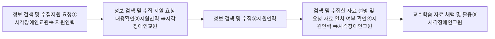

# 나. 교수학습자료 개발 및 준비

### 1) 자료 검색 및 수집

시각장애인교원은 웹 또는 모바일 등 인터넷 환경의 접근성 보장 정도에 따라 정보 접근성에 상당한 영향을 받는다. 시각장애인교원이 교수학습 자료를 개발할 때 실제적인 다양한 정보와 자료를 검색 및 수집하는 경우가 있다. 지원인력은 다음과 같은 정보나 자료의 검색 및 수집을 지원할 수 있다.
시각장애인교원 지원 방안

### □ 정보 검색 및 수집 요청하는 자료의 유형

▪ 도표
▪ 삽화
▪ 지도
▪ 그래프
▪ 사진 등 이미지
▪ 동영상
▪ 그 외 검색 및 수집 요청하는 자료

지원인력이 정보 검색 및 수집을 지원할 때에는 시각장애인교원이 검색 및 수집을 요청하는 자료나 정보에 대한 명확한 이해가 선행된 후에 정보 검색 및 수집을 하여야 한다. 정보 검색 및 수집 지원 절차는 다음과 같이 할 수 있다.

### □ 정보 검색 및 수집 지원 절차

① 시각장애인교원은 지원인력에게 정보 검색 및 수집 지원을 요청한다.
② 시각장애인교원은 지원인력에게 정보 검색 및 수집 지원 요청하는 자료의 내용, 유형 및 분량 등을 설명하고, 지원인력은 요청 내용을 확인한다.
③ 지원인력은 시각장애인교원의 요청에 따라 정보의 검색 및 수집을 수행한다.
④ 지원인력은 정보 검색 및 수집을 완료한 후에 시각장애인교원에게 검색 및 수집한 자료를 설명하고 시각장애인교원이 요청한 자료와 일치하는지 여부를 확인한다.
⑤ 시각장애인교원은 지원인력이 검색 및 수집한 자료가 요청한 자료와 일치하는지 여부를 확인한 후에 교수학습 자료로 채택하여 활용한다.

### 2) 학습활동지 제작

지원인력은 교수학습 과정에서 활용할 학습활동지 제작을 지원할 수 있다. 학습활동지에 들어갈 내용은 주로 시각장애인교원이 작성하고, 지원인력은 학습활동지의 서식, 디자인, 글꼴, 글자 크기, 정렬, 줄간격, 글자색, 표 등의 학습활동지의 형식적인 부분과 학습활동지에 삽입할 그림, 삽화, 사진, 도표, 그래프 등 시각적 자료의 첨부와 편집 등을 지원할 수 있다.
