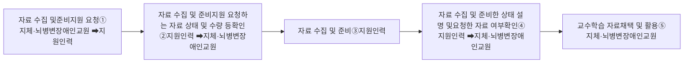

# 나. 교수학습자료 개발 및 준비

### 1) 자료 수집 및 준비

지체·뇌병변장애인교원은 교육환경 및 여건 정도에 따라 물리적 접근성에 상당한 영향을 받는다. 지체·뇌병변장애인교원이 교수학습 자료를 개발할 때 사전에 자료를 수집하고 수업 환경에 맞게 자료를 준비하는 경우 지원인력은 다음과 같은 자료 수집 및 준비를 지원해야 한다.

### □ 수집 및 준비를 필요로 하는 자료 유형

* 한글, ppt, 엑셀 등 수업자료
* 태블릿 PC, 빔 프로젝트, 교사용 컴퓨터 등 수업 기자재
* 과학 실험 도구, 예체능 실기 도구 등 교구 준비 및 제작
* 컴퓨터, 전자칠판, 태블릿 등 전자 교수학습자료
* 학습활동지제작 및 등사
* 그 외 수집 및 준비 요청하는 자료

지원인력이 지체·뇌병변장애인교원의 자료 수집 및 준비를 지원할 때는 지체·뇌병변장애인교원이 수집 및 준비를 요청하는 자료에 대한 명확한 이해가 선행된 후에 자료 수집 및 준비를 해야 한다. 지체·뇌병변장애인교원의 자료 수집 및 준비 절차는 다음과 같이 할 수 있다.

### □ 자료 수집 및 준비 지원 절차 흐름도

① 지체·뇌병변장애인교원이 지원인력에게 자료 수집 및 준비 지원을 요청한다.

② 지체·뇌병변장애인교원은 지원인력에게 자료 수집 및 준비 지원 요청하는 내용을 설명하고, 지원인력은 이를 확인한다.

③ 지원인력은 지체·뇌병변장애인교원의 요청에 따라 자료 수집 및 준비를 수행한다.
④ 지원인력은 자료 수집 및 준비를 완료한 후에 지체·뇌병변장애인교원에게 자료 수집 및 준비 상태를 설명하고 요청한 자료 수집 및 준비가 맞는지 여부를 확인한다.

⑤ 지체·뇌병변장애인교원은 지원인력이 수행한 자료 수집 및 준비가 요청사항과 일치하는지 여부를 확인한 후에 교수학습 자료로 채택하여 활용한다.
