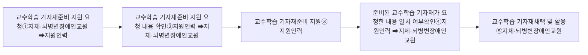

# 가. 교수학습 기자재 준비

지원인력은 지체·뇌병변장애인교원이 수업에서 활용할 교육 기자재 준비 및 조작을 지원할 수 있다. 지원인력은 지체·뇌병변장애인교원에게 수업에서 활용할 교육 기자재 목록과 각 교육 기자재별 활용 시기를 확인하고, 지체·뇌병변장애인교원이 독립적으로 사용할 수 있는 교육 기자재와 사용에 지원이 필요한 교육 기자재를 구분하여 파악한다. 수업에 필요한 교육 기자재에는 수업에서 사용할 교재, 교구 및 학습 자료 준비와 지체·뇌병변장애인교원에게 필요한 보조공학기기 및 음성 자료를 포함한다.

수업 중 주로 사용되는 교육 기자재의 예시는 다음과 같다.

### □ 수업에 필요한 교수학습 기자재 예시

* 컴퓨터 및 노트북
* 테블릿 PC
* 전자칠판
* 프로젝터 및 TV
* 각종 실험 도구
* 각종 악기
* 각종 미술 도구
* 각종 체육 기자재
* 이 외의 지체·뇌병변장애인교원에게 필요한 보조공학기기

**유의사항**

\* 위의 교수학습 기자재 목록은 예시이므로 지원인력은 지체·뇌병변장애인교원과의 협의를 통해 수업에 필요한 교육 기자재를 구체적으로 정하도록 한다.

지체·뇌병변장애인교원의 교수학습 기자재 준비 절차는 다음과 같이 할 수 있다.

### □ 교수학습 기자재 준비 지원 절차 흐름도

① 지체·뇌병변장애인교원은 지원인력에게 교수학습 기자재 준비 지원을 요청한다.

② 지체·뇌병변장애인교원은 수업에 필요한 교수학습 기자재 준비를 지원인력에게 명확히 요청하고, 지원인력은 요
청하는 내용을 확인한다.

③ 지원인력은 지체·뇌병변장애인교원의 요청에 따라 교수학습 기자재 준비를 지원한다.

④ 지원인력은 교수학습 기자재 준비 지원을 완료한 후에 지체·뇌병변장애인교원에게 준비된 교수학습 기자재를 설명하고 지체·뇌병변장애인교원은 요청한 내용과 맞는지 여부를 확인한다.

⑤ 지체·뇌병변장애인교원은 지원인력이 준비된 교수학습 기자재가 요청한 내용과 일치하는지 여부를 확인한 후에 교수학습 기자재를 채택하여 활용한다.
