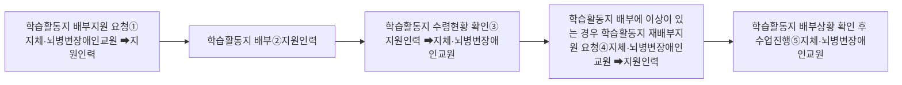
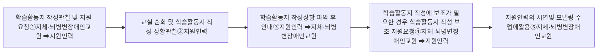
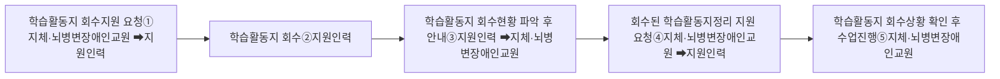

# 다. 학습 활동 지원

지원인력은 학생들의 학습 활동 중 필요한 물리적 지원을 제공하여 지체·뇌병변장애인교원이 수업을 원활하게 진행할 수 있도록 지원하여야 한다. 지원인력은 다음과 같은 학습 활동을 지원해야 한다.

### □ 학습 활동 지원 유형

* 학습활동지 배부, 관찰 및 작성, 회수
* 모둠 활동의 모둠 구성 및 역할 부여
* 학생의 컴퓨터, 전자칠판, 태블릿 등 교수학습 기자재 활용 지원

### 1) 학습활동지

지원인력은 지체·뇌병변장애인교원이 수업의 학습 활동 단계에서 학습활동지를 활용하는 경우 장애 정도에 따라 학습활동지 배부, 학생들의 학습활동지 관찰 및 작성 지원, 학습활동지 회수를 지원해야 한다.

### □ 학습활동지 배부 지원 절차 흐름도

① 수업의 학습 활동 중 지체·뇌병변장애인교원은 지원인력에게 학습활동지 배부 지원을 요청한다.

② 지원인력은 지체·뇌병변장애인교원의 요청에 따라 지원인력은 학습활동지를 학생들에게 배부한다.

③ 학생들에게 학습활동지 배부를 완료한 후에 학생들의 학습활동지 수령 현황을 확인하여 이를 지체·뇌병변장애인
교원에게 안내한다.
④ 지원인력은 학생들 중 학습활동지를 배부받지 못하거나 배부한 학습활동지의 수량이 부족한 경우와 같이 학습활동지 배부에 이상이 있는 경우 지체·뇌병변장애인교원에게 안내하고 지체·뇌병변장애인교원의 요청에 따라 학습활동지 재배부 등을 수행한다.

⑤ 지체·뇌병변장애인교원은 지원인력이 안내한 학습활동지 배부 상황을 다시 한번 확인한 후에 수업을 진행한다.

□ 학습활동지 작성 관찰 및 지원 절차 흐름도

① 수업의 학습 활동 중 지체·뇌병변장애인교원은 지원인력에게 학습활동지 작성 관찰 및 지원을 요청한다.

② 지원인력은 학생들이 학습활동지를 작성하는 동안 지체·뇌병변장애인교원의 요청에 따라 지원인력은 교실을 순회하며 학생들의 학습활동지 작성 상황을 관찰한다.

③ 지원인력은 학생들의 학습활동지 작성 관찰 과정에서 학생들의 학습활동지 작성 진전도 및 완성 여부, 학습활동지 작성에 어려움이 있는 학생 여부, 학습활동지 작성 과제를 수행하지 않는 학생 여부 등을 파악하여 이를 지체·뇌병변장애인교원에게 안내한다.

④ 지원인력은 도움이 필요한 학생이나 학습활동지 작성 과제를 수행하지 않는 학생을 지체·뇌병변장애인교원에게 알려주고, 지체·뇌병변장애인교원의 요청에 따라 해당 학생들의 학습을 보조한다.

⑤ 지체·뇌병변장애인교원은 학생들의 학습활동지 작성 상황을 확인한 후 수업을 진행한다.

□ 학습활동지 회수 지원 절차 흐름도

① 수업의 학습 활동 중 지체·뇌병변장애인교원은 지원인력에게 학습활동지 회수 지원을 요청한다.

② 지원인력은 학생들이 학습활동지 작성 과제를 완료한 후 지체·뇌병변장애인교원의 요청에 따라 학생들의 학습활동지를 회수한다.

③ 지원인력은 학습활동지 회수 현황을 파악하여 이를 지체·뇌병변장애인교원에게 안내한다.

④ 지원인력은 회수한 학습활동지를 지체·뇌병변장애인교원의 요청에 따라 개인 학습활동지 또는 모둠 학습활동지에 따라 학습활동지를 출석번호순 또는 모둠순으로 정리한다.

⑤ 지체·뇌병변장애인교원은 지원인력이 회수한 학습 활동지를 확인하고 수업을 진행한다.
