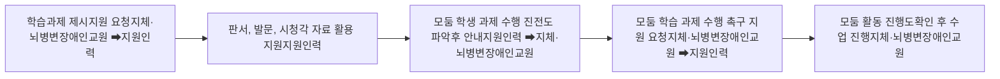
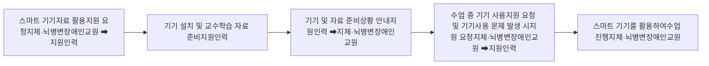

# □ 학습 과제 제시 및 수행 지원 절차 흐름도

### 3) 학생의 컴퓨터, 전자칠판, 태블릿 등 스마트기기 활용 지원 절차

수업을 진행할 때, 학생들이 컴퓨터, 전자칠판, 태블릿 등의 스마트 기기 자료를 효과적으로 활용할 수 있도록 지원을 요청한다.

지원인력은 지체·뇌병변장애인교원의 요청에 따라 전자 기기 설치 및 준비, 교수학습 자료 준비 등을 수업 시작 전에 준비해야 한다.

수업 중 전자 기기 사용에 문제가 발생할 경우 지체·뇌병변장애인교원의 요청에 따라 지원인력은 기기 문제를 해결하거나 소프트웨어 오류를 수정해야 한다.

지체·뇌병변장애인교원이 직접 전자칠판이나 컴퓨터를 조작하기 어려운 경우 지원인력이 대신 조작하며, 자료를 화면에 띄우거나 학습 내용을 전달해야 한다.

학생들이 전자 기기를 활용하여 학습 자료에 접근하는데 어려움이 있는 경우 지체·뇌병변장애인교원의 요청에 따라 기기 사용을 도와주고 필요 시 사용법을 안내한다.

#### □ 스마트 기기 활용 지원 절차 흐름도

**유의사항**

※ 지체·뇌병변장애인교원이 스마트 기기를 조작하기 어려운 경우 지원인력은 페이지 넘김, 자료 이동, 필기 도움 등의 기기 사용을 지원해야 한다.

### 라. 접근이 어렵거나 시각적으로 사각지대에 있는 학생 관찰 및 정보 전달

지체·뇌병변장애인교원의 수업 중 지원인력은 학생들을 관찰하여 지체·뇌병변장애인에게 정보를 전달한다. 특히 지체·뇌병변장애인교원은 교실을 순회하며 수업을 진행하기 어렵기 때문에 접근하기 어려운 곳에 있는 학생이나 시각적으로 사각지대에 있어 관찰이 어려운 경우 지원을 요청할 수 있다. 지원인력이 학생을 관찰하는 내용은 교수학습 상황에 대한 정보와 도전적 행동에 대한 정보 전달로 구분할 수 있다.

#### □ 교수학습 상황 예시

* 교수 활동에 대한 학생의 집중 여부
* 학생의 개인·짝·모둠 학습 과제 수행 진전도
* 학습 과제 수행에 어려움이 있는 학생
* 학습 과제 수행을 하지 않는 학생
