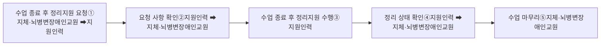

# □ 수업 종료 후 지원 절차 흐름도

① 지체·뇌병변장애인교원이 지원인력에게 수업 종료 후 정리 지원을 요청한다.

② 지체·뇌병변장애인교원은 지원인력에게 수업 종료 후 정리 지원 요청하는 내용을 설명하고, 지원인력은 이를 확인한다.

③ 지원인력은 지체·뇌병변장애인교원의 요청에 따라 수업 종료 후 정리를 수행한다.

④ 지원인력은 수업 종료 후 정리를 완료한 후에 지체·뇌병변장애인교원에게 수업 종료 후 정리 상태를 설명하고 지체·뇌병변장애인교원이 요청한 수업 종료 후 정리가 맞는지 여부를 확인한다.

⑤ 지체·뇌병변장애인교원은 지원인력이 수행한 수업 종료 후 정리가 요청한 수업 종료 후 정리와 일치하는지 여부를 확인한 후에 수업을 마무리한다.
