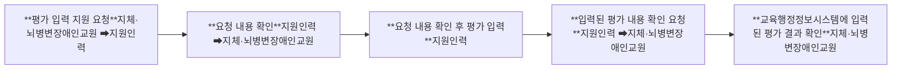

# □ 평가 입력 지원 절차 흐름도

```mermaid
graph LR
    A["**평가 입력 지원 요청**지체·뇌병변장애인교원 ➡지원인력"] --> B["**요청 내용 확인**지원인력 ➡지체·뇌병변장애인교원"]
    B --> C["**요청 내용 확인 후 평가 입력**지원인력"]
    C --> D["**입력된 평가 내용 확인 요청**지원인력 ➡지체·뇌병변장애인교원"]
    D --> E["**교육행정정보시스템에 입력된 평가 결과 확인**지체·뇌병변장애인교원"]
```
