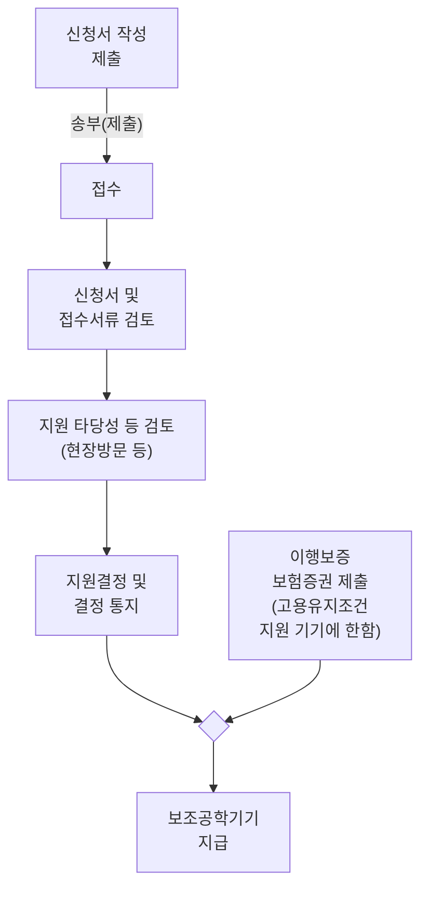

# 2) 의사소통 지원

■ 「장애인 차별금지 및 권리구제 등에 관한 법률」 제21조 및 제23조는 사업장을 포함하여 장애인의 접근권 보장에 관한 사용자와 국가 및 지방자치단체의 의무를 규정하고 있음

- 사용자는 기관이 생산ㆍ배포하는 전자정보 및 비전자정보에 대해 장애인교원이 비장애인교원 등 다른 학교구성원과 동등하게 접근ㆍ이용할 수 있도록 한국수어, 문자 등 필요한 수단을 제공하여야 함

- 사용자는 장애인이 장애의 유형 및 정도, 특성에 따라 한국수어, 구화, 점자 및 인쇄물 접근성바코드가 삽입된 자료, 큰문자 등을 습득하고 이를 활용한 학습지원 서비스를 제공받을 수 있도록 필요한 조치를 강구하여야 하고, 위 서비스를 제공하는 자는 장애인의 의사에 반하여 장애인의 특성을 고려하지 않는 의사소통양식 등을 강요하여서는 안 됨

※ 관련 법령: 「장애인 차별금지 및 권리구제 등에 관한 법률」에 따른 의사소통 지원 관련 내용

> <!-- TODO: image-link source=2023-hr-guide -- 원본: (이미지: 법률 관련 내용을 나타내는 법전과 저울 모양 아이콘입니다.) -->
>
> ▶ **제21조(정보통신ㆍ의사소통 등에서의 정당한 편의제공의무)** ① 제3조제4호ㆍ제6호ㆍ제7호ㆍ제8호 가목 후단 및 나목ㆍ제11호ㆍ제19호ㆍ제20호에 규정된 행위자, 제13호ㆍ제15호부터 제17호까지의 규정에 관련된 행위자, 제10조제1항의 사용자 및 같은 조 제2항의 노동조합 관계자(행위자가 속한 기관을 포함한다. 이하 이 조에서 “행위자 등”이라 한다)는 당해 행위자 등이 생산ㆍ배포하는 전자정보 및 비전자정보에 대하여 장애인이 장애인 아닌 사람과 동등하게 접근ㆍ이용할 수 있도록 한국수어, 문자 등 필요한 수단을 제공하여야 한다. 이 경우 제3조제8호가목 후단 및 나목에서 말하는 자연인은 행위자 등에 포함되지 아니한다. <개정 2016. 2. 3., 2017. 9. 19.>
>
> ② ~ ⑥ (생략)
>
> ▶ **제23조(정보접근ㆍ의사소통에서의 국가 및 지방자치단체의 의무)** ①국가 및 지방자치단체는 장애인의 특성을 고려한 정보통신망 및 정보통신기기의 접근ㆍ이용을 위한 도구의 개발ㆍ보급 및 필요한 지원을 강구하여야 한다.
>
> ② (생략)
>
> ③ 국가와 지방자치단체는 장애인이 장애의 유형 및 정도, 특성에 따라 한국수어, 구화, 점자 및 인쇄물 접근성바코드가 삽입된 자료, 큰문자 등을 습득하고 이를 활용한 학습지원 서비스를 제공받을 수 있도록 필요한 조치를 강구하여야 하며, 위 서비스를 제공하는 자는 장애인의 의사에 반하여 장애인의 특성을 고려하지 않는 의사소통양식 등을 강요하여서는 아니 된다. <개정 2014. 1. 28., 2016. 2. 3., 2017. 12. 19.>

■ 「한국수화언어법」에는 수어통역 지원에 관한 사항을 규정하고 있고, 청각장애인이 구직, 직업훈련, 근로 등 직업 활동 전반에 불이익이 없도록 수어통역을 지원하도록 규정하고 있음

※ 관련 법령: 「한국수화언어법」제16조에 따른 수어통역 지원 관련 내용
<!-- TODO: image-link source=2023-hr-guide -- 원본: (이미지: 법률 조항을 상징하는 아이콘으로, 펼쳐진 책 위에 정의의 저울이 놓여 있는 모습입니다.) -->

▶ **제16조(수어통역)** ① 국가와 지방자치단체는 수어통역을 필요로 하는 농인등에게 수어통역을 지원하여야 한다.

② 국가와 지방자치단체는 공공행사, 사법ㆍ행정 등의 절차, 공공시설 이용, 공영방송, 그 밖에 공익상 필요하다고 인정하는 경우에 수어통역을 지원하여야 한다.

③ 국가와 지방자치단체는 대통령령으로 정하는 중요 정책 등을 발표하는 경우 발표 현장에 수어통역사를 배치하는 등 수어통역을 지원하여야 하며, 발표 내용을 농인등이 알 수 있도록 정보통신망 등을 이용하여 수어통역 영상을 공표하여야 한다. <신설 2022. 1. 18.>

④ 국가와 지방자치단체는 농인등이 구직, 직업훈련, 근로 등 직업 활동 전반에 불이익이 없도록 수어통역을 지원하여야 한다. <개정 2022. 1. 18.>

⑤ 국가와 지방자치단체는 수어통역 관련 전문인력의 양성을 위하여 노력하여야 한다. <개정 2022. 1. 18.>

⑥ 국가와 지방자치단체는 「장애인복지법」 제58조제1항제2호에 따른 장애인 지역사회재활시설 중 수어통역센터를 설치ㆍ운영할 수 있다. <개정 2022. 1. 18.>

* 농인: 청각장애를 가진 사람으로서 농문화 속에서 한국수어를 일상어로 사용하는 사람

### ■ 수어통역 지원

- 지원 대상: 수어통역을 필요로 하는 장애인교원
- 지원 내용: 수어통역사를 통한 수어통역 지원, 제2유형(의사소통형) 근로지원인을 통한 수어통역 지원
- 신청 절차
  ① 수어통역사를 통한 수어통역 지원: 장애인교원이 각급학교 및 시ㆍ도교육청을 통해 수어통역사 지원 요청하고, 각급학교 또는 시ㆍ도교육청은 지역 내 수어통역센터(부록의 기관 정보 활용) 등을 통해 수어통역사를 확보하여 신청한 장애인교원에게 제공
  ② 제2유형(의사소통형) 근로지원인을 통한 수어통역 지원: 장애인교원이 한국장애인고용공단 관할 지사를 통해 신청

### ■ 문자통역 서비스 지원

- 지원 대상: 문자통역을 필요로 하는 장애인교원
- 지원 내용: 문자통역지원 시스템(쉐어타이핑 등)을 활용한 지원 등
- 신청 절차: 시ㆍ도교육청, 각급학교가 직접 문자통역 업체와 계약하여 문자통역 서비스를 제공하거나, 시ㆍ도교육청이 해당 교사에게 예산을 지원하고 해당 교사가 문자 통역 서비스를 직접 신청하여 이용할 수 있음
<aside>
장애인교원의 이해
</aside>

<aside>
장애인교원 인사관리
</aside>

<aside>
장애인교원 편의지원
</aside>

<aside>
부록
</aside>

### 지원 사례

* OO교육청 문자통역 지원 사례
    - 문자 통역 지원 대상 교원 총 7명
    - 활용 방법
        ㆍ교사 1인당 50시간 활용
        ㆍ교사 1인당 5,000천원 지원(100,000원 × 50시간 = 5,000,000원), 지원 금액 범위 내에서 문자통역 관련 물품(블루투스 기기 등) 구입도 가능
        ㆍ지원 대상 교사가 직접 문자 통역 지원 업체와 연락하여 각종 연수 및 회의 시 활용

※ 참고: 쉐어타이핑 홈페이지(www.sharetyping.com)
※ 참고: 에이유디 사회적협동조합 홈페이지(https://audsc.org)

### ■ 의사소통 조력 지원

- 지원 대상: 뇌병변장애, 언어장애를 갖고 있고 의사소통 조력을 필요로 하는 장애인교원
- 지원 내용: 교직 수행 과정에서 명확한 의사소통을 지원(장애인교원의 발화 전달)할 수 있도록 별도로 제공되는 조력인 또는 해당 장애인교원이 지정ㆍ요구하는 인력을 통한 의사소통 조력 지원

### 3) 보조공학기기 지원

#### (1) 개념

■ 장애인교원 보조공학기기 지원은 장애인교원의 신체적ㆍ정신적 기능을 향상ㆍ보완하고, 교직을 수행하며 학교 생활을 하는데 필요한 각종 기계, 기구, 장비 등을 지원하는 편의지원을 말함

#### (2) 지원 근거

■ 교육감 또는 각급학교의 장은 「장애인 차별금지 및 권리구제 등에 관한 법률」제11조 및 같은 법 시행령 제5조에 따라 화면낭독ㆍ확대 프로그램, 무지점자단말기, 확대 독서기, 인쇄물음성변환출력기 등 장애인보조기구, 작업수행을 위한 높낮이 조절용 작업대 등 장애인교원이 해당 직무를 수행함에 있어서 비장애인교원과 동등한 조건에서 일하는데 필요한 보조공학기기를 정당한 사유가 없는 한 해당 보조공학기기를 제공하여야 함
※ 관련 법령: 「장애인 차별금지 및 권리구제 등에 관한 법률」의 보조공학기기 지원 관련 내용

<!-- TODO: image-link source=2023-hr-guide -- 원본: (이미지: 법률 관련 내용을 나타내는 천칭과 법전 모양의 아이콘) -->

▶ 제11조(정당한 편의제공 의무) ①사용자는 장애인이 해당 직무를 수행함에 있어서 장애인 아닌 사람과 동등한 근로조건에서 일할 수 있도록 다음 각 호의 정당한 편의를 제공하여야 한다. <개정 2016. 2. 3.>

1. 시설ㆍ장비의 설치 또는 개조

2. 재활, 기능평가, 치료 등을 위한 근무시간의 변경 또는 조정

3. 훈련 제공 또는 훈련에 있어 편의 제공

4. 지도 매뉴얼 또는 참고자료의 변경

5. 시험 또는 평가과정의 개선

6. 화면낭독ㆍ확대 프로그램, 무지점자단말기, 확대 독서기, 인쇄물음성변환출력기 등 장애인 보조기구의 설치ㆍ운영과 낭독자, 한국수어 통역자 등의 보조인 배치

② 사용자는 정당한 사유 없이 장애를 이유로 장애인의 의사에 반하여 다른 직무에 배치하여서는 아니 된다.

③ 사용자가 제1항에 따라 제공하여야 할 정당한 편의의 구체적 내용 및 적용대상 사업장의 단계적 범위 등에 관하여는 대통령령으로 정한다.

※ 관련 법령: 「장애인 차별금지 및 권리구제 등에 관한 법률 시행령」제5조(사용자 제공 정당한 편의의 내용) 관련 내용

<!-- TODO: image-link source=2023-hr-guide -- 원본: (이미지: 법률 관련 내용을 나타내는 천칭과 법전 모양의 아이콘) -->

▶ 시행령 제5조(사용자 제공 정당한 편의의 내용) 법 제11조제3항에 따라 사용자가 제공하여야 할 정당한 편의의 구체적 내용은 다음 각 호와 같다.

1. 직무수행 장소까지 출입가능한 출입구 및 경사로

2. 작업수행을 위한 높낮이 조절용 작업대 등 시설 및 장비의 설치 또는 개조

3. 재활, 기능평가, 치료 등을 위한 작업일정 변경, 출ㆍ퇴근시간의 조정 등 근로시간의 변경 또는 조정

4. 훈련 보조인력 배치, 높낮이 조절용 책상, 점자자료 등 장애인의 훈련 참여를 보조하기 위한 인력 및 시설 마련

5. 장애인용 작업지시서 또는 작업지침서 구비

6. 시험시간 연장, 확대 답안지 제공 등 장애인의 능력 평가를 위한 보조수단 마련

■ 「장애인 고용촉진 및 직업재활법」 제21조의2에 따르면 보조공학기기 지원은 필요로 하는 보조공학기기를 장애인교원에게 직접 제공하거나 장애인교원이 필요로 하는 보조공학기기를 직접 구입하거나 대여하는 경우 해당 비용을 지원하는 것을 말함

- 장애인교원을 포함한 장애인공무원에 대한 보조공학기기 지원은 「장애인 고용촉진 및 직업재활법」 제21조의2(장애인 공무원에 대한 지원)에 따라 고용노동부장관이 중증장애인 공무원에게 작업 보조 공학기기ㆍ장비 또는 그 공학기기ㆍ장비의 구입ㆍ대여에 드는 비용의 제공을 지원할 수 있음
<aside>
장애인교원의 이해
</aside>

<aside>
장애인교원 인사관리
</aside>

<aside>
장애인교원 편의지원
</aside>

<aside>
부록
</aside>

※ 관련 법령: 「장애인 고용촉진 및 직업재활법」 제21조의2(장애인 공무원에 대한 지원) 관련 내용

> <!-- TODO: image-link source=2023-hr-guide -- 원본: (이미지: 관련 법령 정보를 나타내는 아이콘. 고대 문서나 법전을 상징하는 형태로, 법률 관련 내용을 시각적으로 강조합니다.) --> **▶ 제21조의2(장애인 공무원에 대한 지원)** 고용노동부장관은 장애인 공무원의 원활한 직무수행을 위하여 다음 각 호의 구분에 따른 지원을 할 수 있다. <개정 2022. 1. 11.>
> > 1. 중증장애인 공무원: 제19조의2에 따른 근로지원인 서비스의 제공
> > 2. 장애인 공무원: 제21조제1항제2호에 따른 작업 보조 공학기기ㆍ장비 또는 그 공학기기ㆍ장비의 구입ㆍ대여에 드는 비용의 제공

### (3) 지원 내용

■ 시ㆍ도교육청 및 각급학교는 **장애인교원의 업무 수행을 지원하기 위하여 다양한 형태의 보조공학기기를 지원할 수 있고, 고용노동부장관은 장애인교원이 신청하는 보조공학기기에 대한 구입 비용 등을 지원할 수 있음**

> **지원 사례**
> > * OO교육청이 장애인교원의 업무 수행 지원을 위하여 태블릿 PC, 점자정보단말기(한소네) 등을 자체적으로 지원한 사례

■ **인적지원과 마찬가지로 보조공학기기는 장애인교원의 정당한 편의제공 중 하나이므로 장애인교원이 업무 수행에 필요하다고 판단되면 정당한 사유가 없는 한 사용자는 이를 제공하여야 하므로, 각 시ㆍ도교육청은 매년 장애인교원의 보조공학기기에 대한 수요를 파악하고, 이와 같은 수요에 근거하여 보조공학기기를 효과적으로 제공하기 위한 계획을 수립, 시행할 필요가 있음**

> **지원 사례**
> > * OO교육청이 장애인교원의 업무 수행 지원을 위하여 장애인교원이 필요로 하는 보조공학기기에 대한 수요 조사를 실시하고 이에 따른 예산을 확보하여 장애인교원이 근무하는 학교로 교부한 후, 해당 학교에서는 장애인교원이 필요로 하는 보조공학기기(예, 모니터암, 실내용 전동휠체어, 보청기, 센서리더, 블루투스키보드, 듀얼헤드셋 등)를 구입하여 장애인교원에게 제공한 사례

■ **한국장애인고용공단에서도 장애인공무원에 대한 보조공학기기 지원 사업을 실시하고 있으므로, 교육청 차원의 보조공학기기 지원이 어려운 경우 이와 같은 지원을 장애인교원이 이용할 수 있도록 안내하여야 함**

■ **장애인교원에 대한 보조공학기기 지원은 보조공학기기 구입에 소요되는 비용을 지원하거나, 수리, 유지 또는 대여에 소요되는 비용을 지원하거나 보조공학기기 사용법을 익히고 활용하는데 필요한 제반 사항을 제공하는 것을 포함함**
■ 각 시·도교육청 및 각급학교는 장애인교원이 보조공학기기를 이용하는 과정에서 어떠한 비용도 부담하지 않도록 노력하여야 함

### (4) 지원 가능한 보조공학기기 유형

■ 장애인교원에게 제공 가능한 보조공학기기의 유형은 한국장애인고용공단이 활용하고 있는 보조공학기기 유형을 활용하되, 장애인교원이 업무 수행 과정에서 필요로 하다고 판단되는 각종 보장구(휠체어 등), 교육용 기자재(태블릿PC 등), 관련 장비·시설·기기도구, 프로그램

• 소프트웨어 등이 있다면 지원 가능한 보조공학기기로 판단하여 장애인교원에게 제공할 수 있음

- 지원 가능한 보조공학기기 유형 예

| 종류         | 품목                          | 품목 설명                                                                        | 지원 가능한 장애유형 |
| ---------- | --------------------------- | ---------------------------------------------------------------------------- | ----------- |
| 정보 접근용 | 점자정보단말기                     | • 점자와 음성을 통해 문서입력·출력을 수행할 수 있는 휴대용 점자 정보통신 보조공학기기                            | 시각          |
|            | 점자프린터                       | • 점자로 변환된 문자 정보 또는 점자 정보를 출력해주는 프린터                                          | 시각          |
|            | 컴퓨터화면확대 S/W 및 H/W           | • 컴퓨터 화면을 고배율로 확대 가능한 S/W 및 H/W                                              | 시각          |
|            | 음성출력 S/W 및 H/W(TTS 등 포함)    | • 텍스트 또는 웹페이지 등을 음성으로 변환하여 읽어주는 S/W 및 H/W                                    | 시각          |
|            | 확대독서기                       | • 텍스트 또는 이미지를 고배율로 확대하거나 글자 또는 배경색을 변환해주는 장치                                 | 시각          |
|            | 문서인식 S/W 및 H/W              | • 문자 또는 이미지를 텍스트로 변환하여 주는 S/W 및 H/W                                          | 시각          |
|            | 대형 모니터                      | • 19인치 이상의 대형 컴퓨터모니터                                                         | 시각          |
|            | 스마트 TV                      | • 다양한 기능으로 접근성·활용성이 높고 편리한 TV                                                | 공통          |
|            | 특수 키보드                      | • 표준화된 일반 키보드 활용이 어려운 장애인을 위하여 키(key)의 크기, 모양, 배열 등을 변환한 키보드                 | 시각, 지체·뇌병변  |
|            | 특수 마우스                      | • 표준화된 일반 마우스 활용이 어려운 장애인을 위하여 마우스의 크기, 모양, 클릭 방법 및 형태 등을 변환한 마우스            | 시각, 지체·뇌병변  |
|            | 입력 보조장치                     | • 표준화된 일반 입력장치의 활용이 어려운 장애인을 위하여 키보드 입력 등을 보조해 줄 수 있는 스틱, 키가드 등의 다양한 장치      | 시각, 지체·뇌병변  |
|            | 선택장치                        | • 일반 컴퓨터 및 정보통신 관련 보조공학기기에 대한 접근이 어려운 장애인을 위하여 특별히 고안된 입출력 장치                | 시각, 지체·뇌병변  |
|            | 자세보조장치                      | • 오랫동안 앉아있어야 하는 장애인을 위하여 근육긴장을 완화하고, 원시반사를 감소시키며 관절가동 범위를 유지할 수 있도록 보조해주는 장치 | 지체          |
|            | 특수 S/W                      | • 장애로 인한 제한적 기능을 보완하거나 잔존 기능을 개선할 수 있도록 보조해 줄 수 있는 S/W                       | 시각          |
|            | AI 음성인식 프로그램 (STT, 클로버노트 등) | • 음성파일을 텍스트파일로 변환해주는 프로그램                                                    | 공통          |

장애인교원의 이해

장애인교원 인사관리

장애인교원 편의지원

부록

| 작업 기구용 | FM 시스템                 | • 무선통신 기술을 이용하여 소음이 많은 상황이나 원거리에서도 신호대잡음비(SNR)을 개선하여 원활하게 청취할 수 있도록 도와주는 시스템  | 청각              |
| ---------- | ---------------------- | --------------------------------------------------------------------------------- | --------------- |
|            | 자막안경                   | • 대화 음성을 텍스트(자막)로 변환해주는 기기                                                        | 청각              |
|            | 블루투스 키보드               | • 휴대폰, 노트북, PC 등의 기기와 무선으로 연결하여 정보를 입력하는 키보드                                      | 청각, 지체·뇌병변      |
|            | 높낮이 조절 작업테이블           | • 높이를 조절할 수 있는 책상면을 가진 테이블                                                        | 지체·뇌병변          |
|            | 경사각 작업테이블              | • 경사각 조절이 가능한 책상면을 가진 테이블                                                         | 지체·뇌병변          |
|            | 휠체어용 작업테이블             | • 휠체어 이용 장애인을 위해 책상면이 둥글게 제작된 작업테이블                                               | 지체·뇌병변          |
|            | 특수작업기구 및 장비            | • 장애인이 수행할 수 있는 직무 영역이 확대됨에 따라 그러한 직무를 수행함에 있어 필요한 기능 보완을 위하여 특별히 고안된 보조공학 장치 | 공통              |
|            | 특수작업의자                 | • 오랫동안 앉아있어야 하는 장애인을 위하여 근육긴장 완화 및 원시반사 감소, 관절가동범위 유지에 도움을 주는 의자              | 지체·뇌병변          |
|            | 작업물 운송/운반장치            | • 무거운 작업물을 적재하고 운송/운반하기 쉽게 보조해주는 전자동 장치                                           | 시각, 지체 ·뇌병변 |
| 의사 소통용 | 신호장치 (섬광 기능 장치 등)  | • 소리를 불빛, 진동 등으로 변환하여 주는 장치                                                       | 청각              |
|            | 골도전화기                  | • 골도청력으로 음성을 전달하고 통화가 가능한 전화기 • 문자전화기 음성을 문자로 대체하여 송수신할 수 있는 전화기              | 청각              |
|            | 화상전화기                  | • 영상을 통해 수어통화를 지원하는 전화기 • 소리증폭장치 소리 입력정보를 확대 증폭하여 주는 장치                       | 청각              |
|            | 보완대체의사소통장치 (AAC 등) | • 중증의 의사소통 및 표현에 어려움이 있는 장애인이 그림, 기호를 통해 자신의 의사를 상대방에게 전달하는 장치                | 청각, 뇌병변         |
|            | 문자통역용 모니터              | • 언어적 소통 내용에 대한 문자통역이 이뤄질 때 그에 대한 내용을 볼 수 있는 전용 모니터                           | 청각              |
|            | 블루투스 헤드셋               | • 무선으로 기기와 연결하여 소리를 들을 수 있는 기기                                                    | 지체·뇌병변          |
|            | 마이크 및 스피커              | • 소리를 확장하여 전달하고 들을 수 있도록 돕는 기기                                                    | 청각              |
| 사무 보조용 | 시각장애인용 계산기             | • 입력정보가 소리나 진동으로 변환되는 계산기                                                         | 시각              |
|            | 음성메모기                  | • 외부의 소리, 음성 등을 녹음·녹취할 수 있는 장치                                                    | 공통              |
|            | 책장넘기는 도구               | • 책 페이지를 쉽게 넘기지 못하는 장애인을 위해 머리, 입, 손목 등에 부착하여 책장을 넘길 수 있도록 고안된 보조 장치          | 지체·뇌병변          |
|            | 수화기홀더                  | • 수화기를 잡거나 들기가 어려운 장애인이 손쉽게 수화기를 잡거나 들 수 있도록 고안된 장치                           | 지체·뇌병변          |
|            | 팔지지대                   | • 협응장애, 근력이 약화된 장애인을 위해 상지를 지지해줄 수 있는 장치                                          | 지체·뇌병변          |
|            | 물건집게                   | • 운동기능에 장애를 가진 사람이 멀리 있는 물체를 집을 수 있도록 보완해주는 손잡이 보조구                           | 지체·뇌병변          |
|            | 필기보조도구                 | • 손힘이 약해 필기도구를 쥘 수 없는 장애인을 위해 손, 손목 등에 부착하여 활용할 수 있는 필기보조장치                   | 지체·뇌병변          |
|            | 원고홀더                   | • 책, 서류 등을 고정하여 편안하고 안정된 자세로 볼 수 있도록 보조해주는 장치                                     | 지체·뇌병변          |

| 차량용         | 운전보조    | 핸들봉       | • 손의 근력이 약한 장애인들이 핸들을 쉽고 편하게 회전 시킬 수 있는 장치                    | 지체·뇌병변          |
| ----------- | ------- | --------- | ------------------------------------------------------------- | --------------- |
|             |         | 확장 스티어링   | • 상지가 짧거나 회전 반경이 작은 경우 핸들 조작 보조해주는 장치                         | 지체·뇌병변          |
|             |         | 세컨더리 컨트롤  | • 방향지시등, 비상등 크락션, 와이퍼 등을 전자식 버튼으로 조작하는 장치                     | 지체·뇌병변          |
|             |         | 조작력 저감 장치 | • 저속이나 정차 시에는 조작을 가볍게, 고속 주행 시에는 무겁게 조작하여 운전 편의를 돕기 위한 장치     | 지체·뇌병변          |
|             |         | 핸드컨트롤러    | • 양발 이용이 불편한 장애인들을 위한 장치 (손으로 브레이크와 악셀페달 조작)                  | 지체·뇌병변          |
|             |         | 좌측엑셀페달    | • 오른쪽 다리가 불편하신 분들을 위한 장치(기존 페달에 축을 달아 왼쪽으로 연결하여 왼발로 조작)       | 지체·뇌병변          |
|             |         | 페달 확장     | • 다리 길이가 짧은 분들을 위해 페달 길이 연장을 하여 이용하는 장치                       | 지체·뇌병변          |
|             |         | 우측 턴 시그널  | • 좌측 손 대신 우측 손을 이용하여 좌우의 방향지시등을 제어하는 장치                       | 지체·뇌병변          |
|             |         | 경련방지플레이트  | • 하체의 경련이 있을 경우 발이 페달 등에 닿거나 끼이지 않도록 방지하기 위한 장치               | 지체·뇌병변          |
|             |         | 주차브레이크 개조 | • 발을 이용하는 주차 브레이크에 레버를 장착하여 손으로 조작하도록 하는 장치                   | 지체·뇌병변          |
|             |         | 자동변속기     | • 버튼을 이용하여 자동변속기 조작을 지원하는 장치                                  | 지체·뇌병변          |
|             |         | 족동장치      | • 양 팔을 모두 이용할 수 없는 장애인을 위한 장치(브레이크, 페달, 기어변속, 방향지시등 조작 모두 가능) | 지체·뇌병변          |
|             | 탑재보조    | 벨트류       | • 전방 및 좌우 쏠림을 방지하는 장치                                         | 지체·뇌병변          |
|             |         | 자세유지      | • 척추가 휘어있거나 오래 앉아있기가 힘든 체형일 때 자세를 유지하여 주는 장치                  | 지체·뇌병변          |
|             | 탑재보조    | 크레인       | • 차량에 휠체어를 탑재할 수 있도록 도와주는 장치                                  | 지체·뇌병변          |
|             |         | 도넛형 연료통   | • 도넛형 연료통 개조로 휠체어 등 이동수단의 적재 공단을 확보하는 장치                      | 지체·뇌병변          |
|             | 승·하차 보조 | 리프트       | • 휠체어에 탄 상태에서 후방 리프트를 활용하여 차량 내외로 승·하차를 도와주는 장치               | 지체·뇌병변          |
|             |         | 이동(회전)시트  | • 휠체어에서 운전석이나 조수석으로 옮겨 탈 때 이용되는 장치                            | 지체·뇌병변          |
|             |         | 사이드서포트    | • 휠체어에서 운전석 이동 시 빈 공간을 채워서 낙상 방지 장치                           | 지체·뇌병변          |
|             |         | 멀티리프트     | • 휠체어에서 자동차 시트로의 이동 지원하는 장치                                   | 지체·뇌병변          |
|             |         | 고정장치      | • 수동 및 전동 휠체어를 차량 바닥에 고정하는 장치                                 | 지체              |
|             |         | 경사로(램프)   | • 휠체어에 탄 상태에서 차량 후방 또는 측면 내외로 승하차를 지원하는 장치                    | 지체·뇌병변          |
|             |         | 보조발판      | • 차량에 탑승 시 보조발판을 이용하여 원활하게 탑승하게 지원하는 장치                       | 지체·뇌병변          |
|             |         | 하이루프      | • 차량의 지붕을 높여 탑승공간을 확보하는 장치                                    | 시각, 지체 ·뇌병변 |
| 기타          |         | 자동문       | • 버튼조작으로 문 자동 여닫기를 지원하는 장치                                    | 시각, 지체 ·뇌병변 |
| 개조 또는 주문 제작 |         | -         | • 시중에서 구할 수 있는 기성품으로 지원이 불가하여 개조 또는 주문 제작하는 장치                | 공통              |

* 출처: 한국장애인고용공단 홈페이지에 게시된 보조공학기기 목록을 일부 수정 보완하여 제시한 것임

장애인교원의 이해
장애인교원 인사관리
장애인교원 편의지원
부록

### (5) 보조공학기기 지원 절차

■ 시·도교육청 및 각급학교에서 보조공학기기를 장애인교원에게 지원하는 경우 수요 조사를 실시하여 필요한 보조공학기기를 구매한 후 이를 장애인교원에게 지급할 수 있음

■ 한국장애인고용공단을 통한 보조공학기기 지원은 크게 보조공학기기 지원과 자동차 개조 및 차량용 보조공학기기 지원으로 구분됨

| 구분                         | 지원 한도         | 지원 한도                             |
| -------------------------- | ------------- | --------------------------------- |
| 보조공학기기 지원                  | 고용유지조건 지원     | 장애인 1인당 1,000만원(중증 1,500만원) 한도 지원 |
|                            | 무상지원\*        | 장애인 1인당 300만원(중증 500만원) 한도 지원     |
| 자동차 개조 및 차량용 보조공학기기 지원 | 고용유지조건 지원\*\* | 장애인 1인당 1,500만원 한도 지원             |

* 무상지원 : 지원 기준가액 100만원 미만인 제품

** 고용유지조건지원 : 지원 기준가액 100만원 이상인 제품

<!-- TODO: image-link source=2023-hr-guide -- 원본: (이미지: 안내견 조끼를 입은 골든 리트리버 안내견이 옆에 앉아 있고, 그 옆에 한 여성이 서서 손을 흔들며 밝게 웃고 있는 일러스트입니다. 이 이미지는 장애인 교원을 위한 편의 지원을 상징합니다.) -->
■ 장애인교원은 이러한 보조공학기기 유형을 참고하여 지원 한도 범위 내에서 필요로 하는 보조공학기기를 한국장애인고용공단으로부터 지원받을 수 있음. 구체적인 신청 절차는 다음과 같음

**참고**

### <한국장애인고용공단을 통한 보조공학기기 신청 절차>

■ 장애인교원이 한국장애인고용공단 관할 지사에 직접 신청서 제출

■ **신청시 제출 서류**

- 보조공학기기 지원 신청서(한국장애인고용공단 홈페이지에서 다운로드)(부록 서식 참고)

- 사업자등록증 사본

- 장애인증명서 혹은 장애인 복지카드 사본(앞뒷면)(장애인 기준에 해당함을 증명할 수 있는 서류)

- 공무원증 사본(근로자임을 확인할 수 있는 서류)
