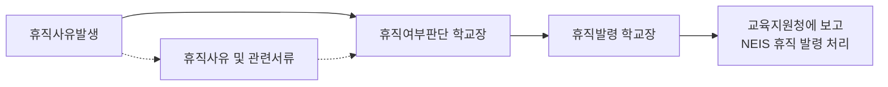

# ■ 교원 성과평가 시 장애인 차별에 대한 진정 사례

→ 국가인권위원회 결정례 전문 내용 중(2015.8.20.)

* **진정 요지**: 진정인은 소아마비로 인한 지체 2급의 장애인이고, 다리 관절염 등의 치료를 위하여 병가를 사용할 수밖에 없는데, 피진정인은 20xx년도 교원 성과평가 기준의 학교 공헌도 항목에서 지각, 조퇴, 병가, 연가의 합산일이 5일을 초과하는 자에 대하여 불리한 평가를 함으로써 장애인을 차별하였다.

* **주문 요지**: 교육부장관에게, 교원의 성과평가 시 장애인 교원에게 불리한 결과가 초래되는 사례가 재발되지 않도록 각 시도 교육청 및 각급 학교에 대한 지도·감독을 강화할 것을 권고한다.

* **판단 요지**: 「장애인차별금지법」 제11조 제1항 제2호에 의하여 사용자는 장애인에 대하여 재활, 기능평가, 치료 등을 위한 근무시간의 변경이나 조정 편의를 제공해야 함에도, OO초등학교가 장애인 교사의 재활 또는 치료목적의 병가 사용에 대해 진정인인 최 교사를 불리하게 대우한 것은 「장애인차별금지법」제4조 제1항 제2호 및 제10조 제1항에서 금지하는 장애인 차별행위에 해당한다고 판단. 「국가공무원복무규정」과 「교원휴가업무처리요령」에서 교원의 법정휴가일수를 보장하고 있음에도, 휴가를 사용하는 교원을 불성실하거나 근무태만자로 간주하고 성과평가에서 불리하게 대우하는 것은 교원의 건강권과 행복추구권을 보장하지 않은 것으로 판단

* **결정례 내용 중**

(중략) 피진정인은 휴가를 덜 사용하는 교사를 우대하고, 휴가의 남용을 예방하고자 인정사실과 같은 평가기준을 마련하였다고 주장하나, 앞서 살펴본 바와 같이 근로자의 건강과 행복추구권을 보장하기 위하여 「국가공무원복무규정」 제24조의2와 「교원휴가업무처리요령」에서 교원의 법정휴가일수를 보장하고 있음에도, 휴가를 사용하는 교원을 불성실하거나 근무태만자로 간주하고 성과평가에서 불리하게 대우하겠다는 것은 장애인과 여성에 대한 차별에 앞서 교원의 건강권과 행복추구권을 인정하지 않는 것이므로 피진정인의 주장은 이유 없다.

만약, 교원의 휴가 사용으로 학생들의 수업결손이 우려되었다면, 「교원휴가업무처리요령」에 따라 소속 교원들에게 특별한 사유가 없는 한 방학 중에 휴가를 사용하도록 그 시기를 조정해 보거나, 수업결손이 발생하지 않도록 시간강사를 채용하는 등으로 교원의 휴식권과 학생의 학습권이 조화를 이룰 수 있는 조치를 고려하였어야 하나, 그러하지 아니하고 법정휴가일수에 훨씬 못미치는 5일의 휴가일수를 성과평가의 기준으로 삼은 것은 교원의 휴식권을 제한하는 것이자 「장애인차별금지법」 제4조 제1항 제2호 및 제10조 제1항에서 금지하는 장애인을 불리하게 대우하는 차별 행위에 해당한다.

다만, 피진정인 ○○○ 교장이 20xx. x. xx. 퇴직을 하였고, 「20xx년도 교사 성과평가 기준표」에서 ‘지각, 조퇴, 병가, 연가’ 항목이 삭제되었으므로, 피진정인에게 별도의 조치가 필요하지 않다고 판단되나, 감독기관인 교육부장관에게 유사한 사례의 재발방지를 위하여 필요한 조치를 권고하는 것이 필요하다고 판단된다.
<page_header>
장애인교원의 이해
</page_header>

### 4) 기타 인사 관리 등

#### (1) 전직 임용 과정에서의 차별 금지

■ 교육전문직원 선발 과정에서 장애인교원이 장애를 이유로 차별 받지 않고 선발될 수 있도록 노력하여야 하며, 교육전문직원 선발 공개경쟁시험에 장애인교원이 응시하는 경우 장애유형, 장애정도를 고려하여 편의지원을 제공하고 장애 특성에 따른 평가 방안을 마련할 수 있도록 노력하여야 함

#### (2) 특별연수 대상자 선발 및 실시 과정에서의 차별 금지

■ 장애인교원을 국내외의 교육기관 또는 연구기관에서 일정 기간 연수를 받게 하는 특별연수 대상자 선발 및 실시 과정에서 장애로 인하여 차별받지 않도록 노력하여야 함

<page_header>
장애인교원 인사관리
</page_header>

#### (3) 휴직 · 복직

■ 장애인교원이 재활, 재활치료, 질병치료, 요양 등을 위하여 장기간 요양을 필요로 하는 경우 신분을 유지하면서 휴직할 수 있음

■ 교원이 질병휴직 후 복직을 신청할 경우 임용권자가 의사진단서 또는 교직수행이 가능함을 증빙하는 기타 서류(재활훈련기관에서 발급한 재활훈련 이수를 증빙하는 서류 등)로 복직 처리

■ 복직을 위한 증빙 서류로 의사진단서 제출만을 요구하지 않도록 유의하여야 하고, 교직 수행이 가능함을 증빙하는 기타 서류로 복직 처리가 가능함

<page_header>
장애인교원 편의지원
</page_header>

- 요건: 장애인교원이 신체 · 정신상의 장애로 장기요양이 필요하다고 판단하여 임용권자에게 그 사유를 제출하였을 때

- 기간: 1년 이내(부득이한 경우 1년 범위 내 연장 가능)

- 경력인정: 공무상 질병의 경우에만 경력 인정

- 봉급 지급: 1년 이하 70%, 1년 초과 2년 이하 50% 지급. 공무상 질병은 전액 지급

- 질병 휴직 신청시 의사진단서를 첨부하여야 함

<page_header>
부록
</page_header>

- 휴직 처리 절차

※ 관련 근거: 「교육공무원법」 제44조(휴직)

> > <!-- TODO: image-link source=2023-hr-guide -- 원본: (이미지: 파란색 법률 아이콘으로, 저울과 책이 그려져 있으며 「교육공무원법」 제44조(휴직)에 대한 설명을 시각적으로 나타냅니다.) -->
> > ▶ 제44조(휴직) ① 교육공무원이 다음 각 호의 어느 하나에 해당하는 사유로 휴직을 원하면 임용권자는 휴직을 명할 수 있다. 다만, 제1호부터 제4호까지 및 제11호의 경우에는 본인의 의사와 관계없이 휴직을 명하여야 하고, 제7호, 제7호의2 및 제7호의3의 경우에는 본인이 원하면 휴직을 명하여야 한다.
>
> > 1. 신체상ㆍ정신상의 장애로 장기요양이 필요할 때
>
> > 2.~12. (생략)
>
> > ② ~ ③ (생략)
>
> > ④ 임면권자(任免權者)는 제1항제7호 및 제7호의2에 따른 휴직을 이유로 인사상 불리한 처우를 하여서는 아니 되며, 같은 호의 휴직기간은 근속기간에 포함한다.
>
> > ⑤ 제1항의 휴직제도 운영에 필요한 사항은 대통령령으로 정한다.

- 복직 등: 휴직사유 소멸 시 30일 이내에 임용권자에게 신고하여야 하고, 휴직기간 만료 시 30일 이내에 복귀 신고를 하여야 함(당연복직)

### (4) 휴가ㆍ병가 사용 안내

■ **[병가 사용 안내]** 각 시ㆍ도교육청은 각급학교에 장애인교원이 재활치료 등 장애 관련 사항을 목적으로 연간 60일 범위 내에서 병가 사용이 가능함을 안내

※ 관련 근거: 「국가공무원 복무·징계 관련 예규」

> > <!-- TODO: image-link source=2023-hr-guide -- 원본: (이미지: 파란색 법률 아이콘으로, 저울과 책이 그려져 있으며 「국가공무원 복무·징계 관련 예규」에 대한 설명을 시각적으로 나타냅니다.) -->
> > • 국가공무원 복무·징계 관련 예규에 따른 병가의 종류별 내용
>
> > (가) 일반병가는 다음의 경우 연간 60일의 범위 안에서 승인함
>
> > ※예1) 위암으로 인한 수술이나 입원으로 직무를 수행할 수 없을 때
>
> > ※예2) 장애인공무원이 재활치료를 하지 않으면 직무를 수행할 수 없을 때

■ **[특별휴가 등의 조치]** 장애인교원의 교육활동 보호를 위하여 필요하다고 인정하는 경우 각 시ㆍ도교육청의 재량에 의한 특별휴가 부여 가능

※ 관련 근거: 「교원의 지위 향상 및 교육활동 보호를 위한 특별법」 관련 조항
> 장애인교원의 이해

> 장애인교원 인사관리

> 장애인교원 편의지원

> 부록

<!-- TODO: image-link source=2023-hr-guide -- 원본: (이미지: 법률 조항임을 나타내는 책과 저울 모양의 아이콘입니다.) -->

▶ **제14조(교원의 교육활동 보호에 관한 종합계획의 수립 · 시행 등)** ① 국가, 지방자치단체, 그 밖의 공공단체는 교원이 교육활동을 원활하게 수행할 수 있도록 적극 협조하여야 한다.

② 교육부장관은 **교원의 교육활동 보호 정책을 효율적으로 추진하기 위하여 관계 중앙행정기관의 장과의 협의를 거쳐 5년마다 교원의 교육활동 보호에 관한 종합계획(이하 “종합계획”이라 한다)을 수립 · 시행하여야 한다.** <신설 2023. 9. 27.>

③ 종합계획에는 다음 각 호의 내용이 포함되어야 한다. <개정 2023. 9. 27.>

1. 교원의 교육활동 보호 정책의 추진 목표 및 전략

2. 교육활동 침해행위와 관련된 조사 · 관리 및 교원의 보호조치에 관한 사항

3. 교육활동 보호와 관련된 유아 및 학생 생활지도에 관한 사항

4. 교육활동과 관련된 분쟁의 조정, 교원에 대한 법률 상담 및 변호사 선임 등 소송 지원에 관한 사항

5. 교원에 대한 민원 등의 조사 및 관리에 관한 사항

6. 그 밖에 교원의 교육활동 보호를 위하여 필요하다고 인정되는 사항

④ 교육부장관은 교원의 교육활동 여건의 변화 등으로 종합계획을 변경할 필요가 있는 경우에는 관계 중앙행정기관의 장과의 협의를 거쳐 종합계획을 변경할 수 있다. 다만, 대통령령으로 정하는 경미한 사항을 변경하는 경우에는 그러하지 아니하다. <신설 2023. 9. 27.>

⑤ 교육부장관은 제2항 및 제4항에 따라 종합계획을 수립하거나 변경하였을 때에는 지체 없이 이를 관계 중앙행정기관의 장 및 교육감에게 통보하여야 한다. <신설 2023. 9. 27.>

⑥ 교육부장관은 종합계획을 수립 · 시행하기 위하여 필요한 경우 관계 중앙행정기관의 장, 교육감, 관계 기관 또는 단체의 장에게 협조를 요청할 수 있다. 이 경우 요청을 받은 중앙행정기관의 장, 교육감, 관계 기관 또는 단체의 장은 정당한 사유가 없으면 이에 협조하여야 한다. <신설 2023. 9. 27.>

⑦ 교육부장관은 매년 제2항에 따른 종합계획의 추진현황 및 실적 등에 관한 보고서를 국회에 제출하여야 한다. <신설 2023. 9. 27.>

⑧ 그 밖에 종합계획의 수립 · 시행 및 보고서 제출 등에 필요한 사항은 대통령령으로 정한다. <개정 2023. 9. 27.>

▶ **[시행령] 제2조의2(교원의 교육활동 보호를 위한 시책 등)** ① 특별시 · 광역시 · 특별자치시 · 도 및 특별자치도(이하 “시 · 도”라 한다)의 교육감(이하 “교육감”이라 한다)은 **「교원의 지위 향상 및 교육활동 보호를 위한 특별법」(이하 “법”이라 한다) 제14조제2항에 따라 다음 각 호의 사항에 관한 시책을 법 제19조제1항에 따른 시 · 도교권보호위원회의 심의를 거쳐 수립 · 시행해야 한다.** <개정 2019. 10. 15.>

1. 교육활동 보호를 전담하는 기관 및 조직의 구성 · 운영

2. 교육활동 보호를 위한 교원 연수 및 홍보

3. 교육활동 침해를 당한 교원의 치료, 전보(轉補) 등 보호 조치

4. 법 제14조의2제1항에 따른 법률 상담

5. 제7조제3항에 따른 교육활동 침해 등에 대한 조사 및 관리

6. 그 밖에 교육활동을 보호하고 교육활동 침해에 대응하기 위하여 필요한 사항

② 삭제 <2019. 10. 15.>

## 관련 페이지

같은 챕터의 다른 페이지:

- [[2023-hr-6]] — 6) 근무환경 개선 지원
- [[2023-hr-7]] — 7) 장애인교원에 대한 인식개선 노력
- [[2023-hr-8]] — 8) 장애인지원관의 지정 등
- [[2023-hr-p-055]] — 편의지원 제공 의무의 원칙
- [[2023-hr-p-057]] — ■ 장애인교원의 인적지원 등 정당한 편의제공 거부에 대한 차별 진정 사례
