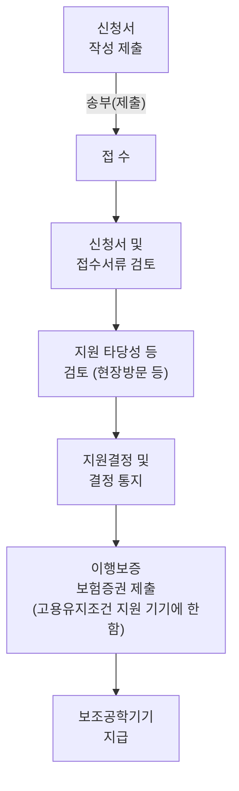

# 보조공학기기 지원 신청서

* 고용부 고시 「사업주 및 장애인 등에 대한 융자·지원 규정」 별지8 서식 (앞쪽)

| 보조공학기기 지원 신청서 ①신청인(사업주 또는장애인근로자) | 보조공학기기 지원 신청서 사업체명(기관명) 법인등록번호(법인인 경우) | 보조공학기기 지원 신청서                                                                              | 보조공학기기 지원 신청서 신청인 성명(대표자/근로자) 주민등록번호(개인사업자/근로자인 경우) | 보조공학기기 지원 신청서 | 처리기한30일 | 처리기한30일 |
| ------------------------------------ | ---------------------------------------------- | ------------------------------------------------------------------------------------------ | ----------------------------------------------------------- | ------------- | ------- | ------- |
| ② 사업장 개요                     | 사업장명                                           |                                                                                            | 사업자등록번호                                                     |               |         |         |
|                                      | 소재지                                            | 본 사                                                                                        |                                                             |               |         |         |
|                                      |                                                | 사업장                                                                                        |                                                             |               |         |         |
|                                      | 연락처                                            | 담당자명                                                                                       |                                                             | 직위            |         |         |
|                                      |                                                | 전화                                                                                         |                                                             | 휴대폰           |         |         |
|                                      |                                                | 팩스                                                                                         |                                                             | E-mail        |         |         |
|                                      | 장애인 고용의무                                   | 1.적용 2.비적용                                                                                 | 업종(주생산품)                                                    |               |         |         |
|                                      | 상시근로자수                                         | 명                                                                                          | 장애인 근로자수                                                    | 명             |         |         |
| ③ 이용 장애인                     |                                                | 별지 참조                                                                                      |                                                             |               |         |         |
| ④ 신청기기                           |                                                | 별지 참조                                                                                      |                                                             |               |         |         |
| ⑤ 확인 사항                      |                                                | 신청 기기와 유사한 용도의 정부지원금 또는 기기를 지급받은 사실이 없음을 확인함.  신청인 : (서명 또는 날인)                    |                                                             |               |         |         |
| 유의사항 안내                          |                                                | 고의나 과실로 발생하는 수리비용과 소모품 교체비용, 합리적 사유없이 기기를 임의 반납하는 경우 운송료, 기기를 손망실한 경우 물품의 잔존가액은 자체 부담하여야 함 |                                                             |               |         |         |

「사업주 및 장애인 등에 대한 융자·지원규정」 제22조 제1항의 규정에 따라 보조공학기기 지원을 위와 같이 신청합니다.

2021년     월     일

**신청인**:      (서명 또는 날인)

**한국장애인고용공단 귀하**

| 담당직원확인사항  | 1. 사업자등록증 사본 1부                                             | 수수료 |
| --------- | ----------------------------------------------------------- | --- |
| 구비 서류 | 1. 지원기기 이용자가 장애인 기준에 해당함을 증명할 수 있는 서류(취업알선전상망 등록시 대체 가능) 1부 | 없음  |
|           | 2. 지원기기 이용 장애인이 근로자임을 확인할 수 있는 서류 1부                        |     |

### 행정정보 공동이용 동의서

본인은 이 건 업무처리와 관련하여 담당 직원이 「전자정부법」 제36조제1항에 따른 행정정보의 공동이용을 통하여 위의 '담당직원 확인사항'을 확인하는 것에 동의합니다.

* 동의하지 않는 경우에는 신청인(사업주)이 직접 관련 서류를 제출하여야 합니다.

**신청인(사업주)**:      (서명 또는 인)

210mm×297mm(일반용지 60g/m²(재활용품))
※ 이 신청서는 아래와 같이 처리됩니다. (뒤쪽)

| 신청자 | 처리기관      |
| --- | --------- |
| 사업주 | 한국장애인고용공단 |

**※ 기재요령**

① ~ ②은 보조공학기기 신청 사업체에 해당하는 사항을 기재합니다.

③ ~ ④는 보조공학기기 이용 장애인에 관한 사항을 기재하며, 지원희망기기는 지원품목 및 제품 목록을 참조하여 기재합니다.

⑤ 확인사항은 무상지원, 고용유지조건 지원 신청자 모두에게 해당되는 사항입니다.
<aside>
장애인교원의 이해
장애인교원 인사관리
장애인교원 편의지원
부록
</aside>

[별지 제8호서식 별지]
