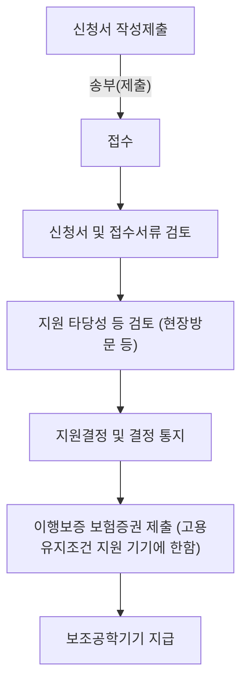

# 나) 지원 내용

◦시·도 교육청 및 각급 학교는 장애인 교원의 업무 수행을 지원하기 위해 다양한 형태의 보조공학기기를 제공할 수 있으며, 고용노동부 장관은 장애인 교원이 신청하는 보조공학기기의 구입 비용 등을 지원할 수 있음. 이 과정에서 장애인 교원이 보조공학기기를 이용하는 데 필요한 비용은 어떠한 부담도 없어야 하며, 지원 내용에는 보조공학기기 구입, 수리, 유지 또는 대여에 드는 비용과 보조공학기기 사용법을 익히고 활용하는 데 필요한 제반 사항이 포함됨.

◦인적 지원과 마찬가지로 보조공학기기는 장애인 교원의 정당한 편의 제공의 일환으로, 장애인 교원이 필요하다고 판단할 경우 정당한 사유 없는 한 사용자에게 이를 제공해야 함. 따라서 각 시·도 교육청은 매년 장애인 교원의 보조공학기기에 대한 수요를 파악하고, 이를 바탕으로 효과적인 지원 계획을 수립하고 시행해야 함.

◦한국장애인고용공단은 장애인 공무원에 대한 보조공학기기 지원 사업을 실시하고 있으므로, 교육청 차원의 지원이 어려운 경우 장애인 교원이 이 지원을 이용할 수 있도록 안내해야 함

◦장애인 교원에게 제공 가능한 보조공학기기 유형은 한국장애인고용공단이 활용하는 기기들을 바탕으로 하며, 장애인 교원이 필요하다고 판단되는 각종 보장구(예: 휠체어), 교육용 기자재(예: 태블릿PC), 관련 장비 및 시설, 프로그램과 소프트웨어 등이 포함됨.
### 다) 보조공학기기 지원 절차

◦시ㆍ도교육청 및 각급학교에서 보조공학기기를 장애인교원에게 지원하는 경우 수요 조사를 실시하여 필요한 보조공학기기를 구매한 후 이를 장애인교원에게 지급할 수 있음

◦한국장애인고용공단을 통한 보조공학기기 지원은 크게 보조공학기기 지원과 자동차 개조 및 차량용 보조공학기기 지원으로 구분됨

| 구분                         | 지원 한도             | 지원 한도                                    |
| -------------------------- | ----------------- | ---------------------------------------- |
| 보조공학기기 지원                  | 고용유지조건 지원         | · 장애인 1인당 1,000만원 (중증 1,500만원) 한도 지원 |
|                            | 무상지원\\\*          | · 장애인 1인당 300만원 (중증 500만원) 한도 지원     |
| 자동차 개조 및 차량용 보조공학기기 지원 | 고용유지조건 지원\\\*\\\* | · 장애인 1인당 1,500만원 한도 지원                  |

\* 무상지원: 지원 기준가액 100만원 미만인 제품

\*\* 고용유지조건지원: 지원 기준가액 100만원 이상인 제품

◦장애인교원은 이러한 보조공학기기 유형을 참고하여 지원 한도 범위 내에서 필요로 하는 보조공학기기를 한국장애인고용공단으로부터 지원받을 수 있음. 구체적인 신청 절차는 다음과 같음

<!-- TODO: image-link source=2024-jbu-work-support-guide -- 원본: (이미지: 한국장애인고용공단을 통한 보조공학기기 지원 절차를 설명하는 순서도입니다. 신청서 작성 및 제출, 접수, 신청서 및 접수 서류 검토, 지원 타당성 검토(현장 방문 등 포함), 지원 결정 및 통지 단계를 거쳐 보조공학기기가 지급됩니다. 고용유지조건 지원 기기 구매 시에는 이행보증 보험증권 제출 단계가 추가됩니다. 신청 시 제출 서류로는 보조공학기기 지원 신청서, 사업자등록증 사본, 장애인증명서 또는 장애인 복지카드 사본, 그리고 공무원증 사본이 필요합니다.) -->

### 참 고

▪장애인교원이 한국장애인고용공단 관할 지사에 직접 신청서 제출

▪신청시 제출 서류

- 보조공학기기 지원 신청서(한국장애인고용공단 홈페이지에서 다운로드)(부록 서식 참고)

- 사업자등록증 사본

- 장애인증명서 혹은 장애인 복지카드 사본(앞뒷면)(장애인 기준에 해당함을 증명할 수 있는 서류)

- 공무원증 사본(근로자임을 확인할 수 있는 서류)
