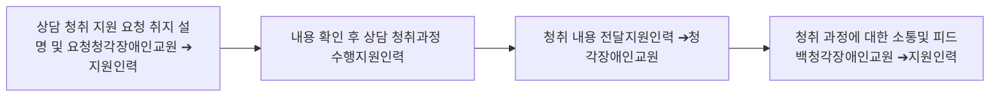

# 가. 상담

청각장애인교원이 학부모 및 학생과 원활한 상담을 진행하고 그 상담 결과 신뢰할 수 있는 교사로 인지될 수 있도록 청각장애인교원의 학부모 및 학생과 소통하는 과정을 지원하는 활동이다. 상담 공간에서 청각장애인교원과 함께 청취 활동을 하며 청각장애인교원이 희망하는 방법으로 기록하여 상담 후 제공한다. 단, 학부모 상담 활동의 경우 청각장애인교원의 요청이나 학부모의 요청이 있는 경우 상담 공간에서 이석할 수 있다. 지원인력의 상담 공간에서의 이석에 대해서는 청각장애인교원과 사전에 충분히 협의하여 정하도록 한다.

### □ 청각장애인교원 상담 지원 절차

